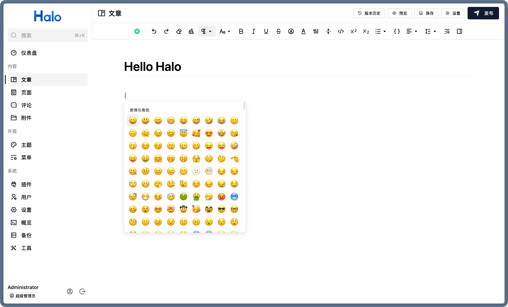
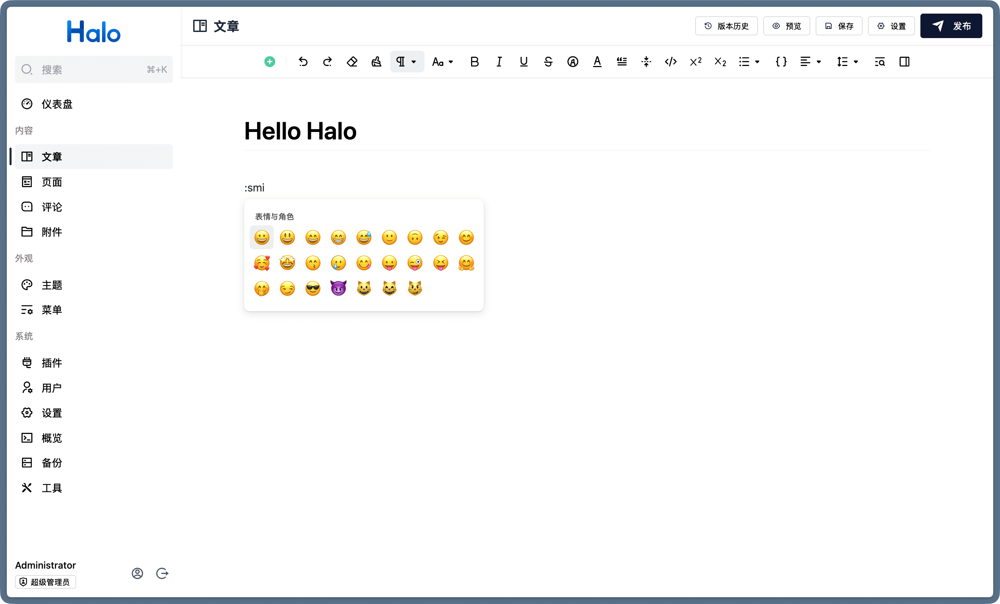

## Emoji 表情选择器

为 Halo 的默认编辑器提供 Emoji 表情选择器。

## 预览





## 使用

1. 可以在下面的地址中下载插件：
   1. [Halo 应用市场](https://www.halo.run/store/apps/app-pwojlwgu)
   2. [GitHub](https://github.com/halo-sigs/plugin-editor-emoji/releases)
2. 安装之后启动即可，唤起 Emoji 选择器的方式为：
   - 在编辑器任意文本位置输入 `:<关键词>` 可以唤起 Emoji 选择器并搜索表情
   - 在编辑器中输入 `/` 打开指令面板，搜索 `Emoji` 可以唤起 Emoji 选择器

## 开发

```bash
git clone https://github.com/halo-sigs/plugin-editor-emoji.git

# 构建并启动一个 Docker 容器
./gradlew haloServer

# 启动 UI 
cd ui && pnpm dev
```
